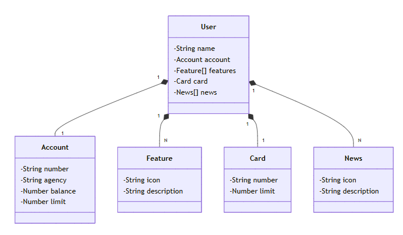

# Bank API Spring Boot

REST API developed with Spring Boot for banking user management.

This project was developed as a practical study application inspired by concepts explored during the **TOTVS - Fundamentos de Engenharia de Dados e Machine Learning** bootcamp, offered by **DIO (Digital Innovation One)**.

The implementation was adapted and expanded during development to reinforce concepts involving software engineering, REST API development, persistence and relational modeling.

---

## Learning Context

The project was developed based on concepts studied during the bootcamp and expanded through practical implementation activities, including:

- REST API development
- Entity relationship modeling
- CRUD operations
- JPA and Hibernate persistence
- H2 database integration
- API validation using Postman
- SQL troubleshooting and schema adjustments
- Git and GitHub versioning

During development, improvements and fixes were implemented beyond the original educational reference, including persistence corrections, entity relationship adjustments and database compatibility improvements.

---

## Domain Model

The API was structured around a banking domain model using JPA entity relationships.



Relationships:

- User → Account (1:1)
- User → Card (1:1)
- User → Feature (1:N)
- User → News (1:N)

---

## Technologies

- Java
- Spring Boot
- Spring Data JPA
- Hibernate
- H2 Database
- Maven
- Git
- GitHub
- Postman

---

## Features

- Create users
- List users
- Get user by ID
- Update users
- Delete users
- Banking account management
- Card management
- Features and news association

---

## API Endpoints

### Create User

POST

```http
/users
```

Example:

```json
{
  "name": "Roberto",
  "account": {
    "number": "12345",
    "agency": "0001",
    "balance": 1500,
    "limit": 5000
  },
  "card": {
    "number": "9999888877776666",
    "limit": 5000
  },
  "features": [
    {
      "icon": "PIX",
      "description": "Transferência instantânea"
    }
  ],
  "news": [
    {
      "icon": "INFO",
      "description": "Nova funcionalidade"
    }
  ]
}
```

### List Users

GET

```http
/users
```

### Get User By ID

GET

```http
/users/{id}
```

### Update User

PUT

```http
/users/{id}
```

### Delete User

DELETE

```http
/users/{id}
```

---

## Running Locally

Clone repository:

```bash
git clone https://github.com/robertosulkovski/bank-api-springboot.git
```

Enter project folder:

```bash
cd bank-api-springboot
```

Run application:

```bash
mvn spring-boot:run
```

Application available at:

```http
http://localhost:8080/users
```

---

## Project Highlights

Practical challenges addressed during development:

- SQL reserved keyword conflict resolution
- Hibernate configuration adjustments
- Entity relationship corrections
- API endpoint validation using Postman
- Data persistence troubleshooting
- H2 database schema adjustments

---

## References and Acknowledgements

This project was developed based on concepts studied during:

**TOTVS - Fundamentos de Engenharia de Dados e Machine Learning**

Offered by:

**DIO (Digital Innovation One)**

Part of the domain design reference and domain model image were inspired by:

https://github.com/digitalinnovationone/santander-dev-week-2023-api

The implementation was adapted, expanded and adjusted during development for learning purposes, including persistence improvements, database troubleshooting and API validation.

---

## Author

Roberto Sulkovski
